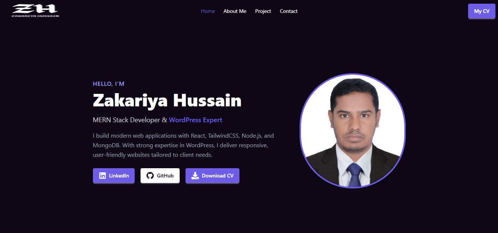

# 🌐 Personal Portfolio Website

A modern, responsive **personal portfolio website** built with **React**, **Tailwind CSS**, and **DaisyUI**.  
Showcases my skills, projects, and experience — with an interactive contact section and a professional UI design.

---

## 📸 Preview

---

## 🚀 Features

- **Modern UI** using Tailwind CSS + DaisyUI  
- **Responsive Design** (mobile-friendly)  
- **Smooth Scroll** navigation  
- **Projects Showcase** with GitHub & Live links  
- **Skills Section** (Frontend, Backend, Tools)  
- **Experience Section** with timeline  
- **Contact Section** with WhatsApp and Email links  
- **Download CV** button  
- **Footer with Social Links**

---

## 🛠️ Tech Stack

**Frontend**
- React.js
- Tailwind CSS
- DaisyUI
- React Icons

**Deployment**
- Netlify

